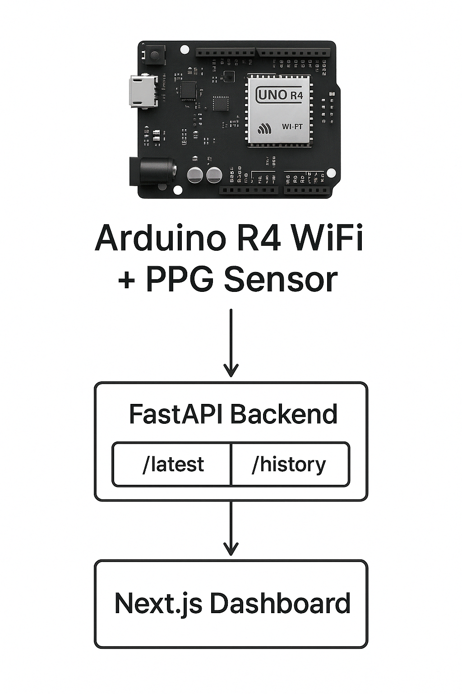
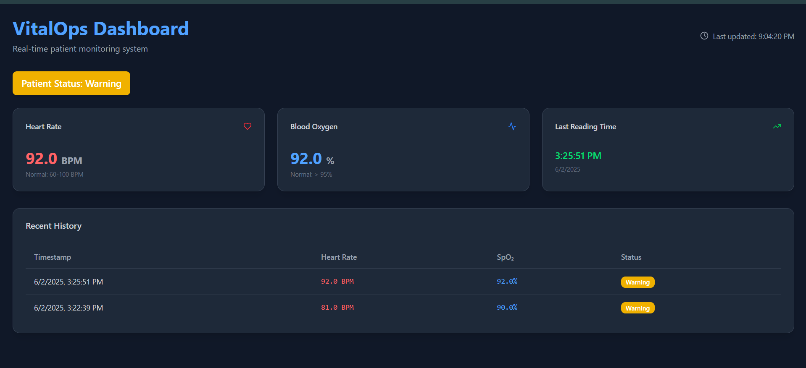
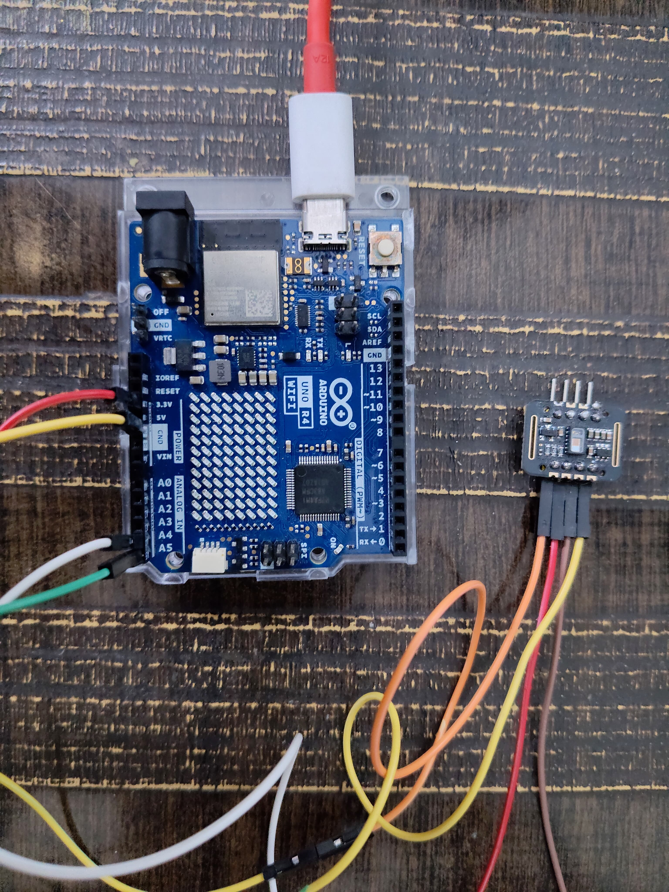

# 🩺 VitalOps – Real-Time Health Monitoring at the DevOps Intersection

**🚀 X-RAPTORS Hackathon 2025 – The Intersection Challenge**  
**👥 Team:** *LazyBird*  
**🌐 Live App:** [https://vitalops-app.onrender.com](https://vitalops.onrender.com/)  
**💻 GitHub Repo:** [https://github.com/fizakhan90/vitalops](https://github.com/fizakhan90/vitalops)  
**🎥 Demo Video:** *[Add your demo video link here]*

---

## ⚡ The Idea: Real Innovation Happens at Intersections

VitalOps was built where **Healthcare** meets **DevOps** — combining real patient needs with reliable engineering.

For the **Intersection Challenge** at X-RAPTORS Hackathon, we created **VitalOps**, a real-time health monitoring system that uses actual hardware and DevOps tools to deliver critical health data in a fast, efficient, and reliable way.

---

## 🎯 Mission: Make HealthTech Reliable, Fast & Scalable

**VitalOps** is a remote health monitoring system that:
- Uses **real hardware** — an Arduino R4 WiFi board with a PPG sensor — to collect heart rate and SpO₂ data.
- Sends and validates this data in real time using our backend.
- Shows live vitals on a clean, responsive dashboard.
- Uses a fully automated **CI/CD pipeline** for quick and dependable updates.

This project lives at the **intersection of Health and DevOps**, showing how both fields can work together to solve real problems.

---

## 🔀 The Power of the Intersection: Health x DevOps

### 🏥 Health Side
- Tracks important vitals (heart rate and oxygen levels) in real time.
- Helps with remote health monitoring, especially useful for elderly care.
- Easy-to-use dashboard with live and historical data.
- Health status indicators: **Normal**, **Warning**, or **Critical**.

### ⚙️ DevOps Side
- **CI/CD pipeline** with GitHub Actions to automate testing and deployment.
- Backend and frontend packed in one **Docker** container for consistency.
- Hosted using **GHCR** and deployed via **Render.com**.
- The frontend is statically exported and served through FastAPI.

### 🎇 What Happens When They Meet
- Health systems need to be **reliable** → DevOps makes sure they are.
- Medical software needs to **move fast** → CI/CD helps push safe updates quickly.
- The result: A **stable, scalable, real-time health system** powered by actual hardware and smart software.


## 🛠 Features

✅ Real-time vital signs ingestion  
✅ Backend validation for error codes, data types, and ranges  
✅ Dynamic dashboard with patient status indicators  
✅ History of last 10 readings with timestamps  
✅ Auto-refresh, error handling, retry mechanism  
✅ Unified Dockerized deployment with CI/CD  
✅ Deployed to production automatically on push to `main`

---

## 🧪 Tech Stack

**Backend**  
- Python, FastAPI, Pydantic, Uvicorn

**Frontend**  
- Next.js (React + TypeScript), Tailwind CSS, shadcn/ui, lucide-react

**DevOps**  
- Docker, GitHub Actions (CI/CD), GitHub Container Registry (GHCR), Render.com

**Simulated IoT Hardware**  
- Arduino UNO R4 WiFi   
- PPG Sensor (for HR and SpO₂)

---

## 🧩 Architecture Overview



---

## 📦 CI/CD Workflow

On every push to `main`:
1. 🔧 Build frontend (`npm run build`) → static export  
2. 📁 Copy exported assets into `backend/static`  
3. 🐳 Build full Docker image (backend + static frontend)  
4. 📤 Push image to GitHub Container Registry (GHCR)  
5. 🚀 Trigger deploy hook on Render.com  

✅ **Result:** Zero-click production deployment from commit to live app.

---

## 🧰 Local Setup

### 1. Clone the Repo

```bash
git clone https://github.com/fizakhan90/vitalops.git
cd vitalops
```
### 2. Run Backend 
```bash
cd backend
python -m venv venv
source venv/bin/activate  # or venv\Scripts\activate (Windows)
pip install -r requirements.txt
uvicorn main:app --host 0.0.0.0 --port 5000
```
### 3. Run Frontend
```bash
cd frontend
npm install

# Ensure .env.local has:
# NEXT_PUBLIC_API_URL=http://localhost:5000

npm run dev
```
### 4. Dockerized App (Full Stack)
```bash
# After copying frontend/out/* → backend/static/
cd backend
docker build -t vitalops-local .
docker run -p 5000:5000 vitalops-local

# App available at: http://localhost:5000
```
## 📸 Screenshots

### 📊 Live Dashboard with Status Indicator


### 💻  Hardware Setup



